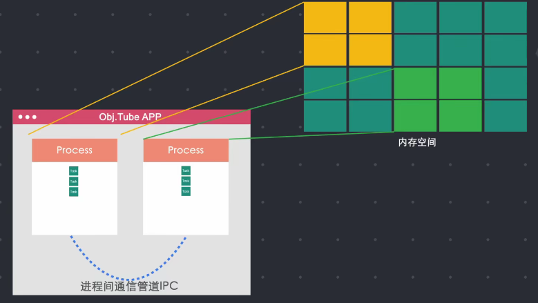
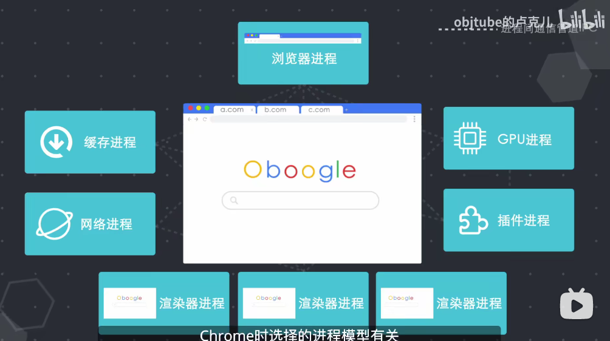
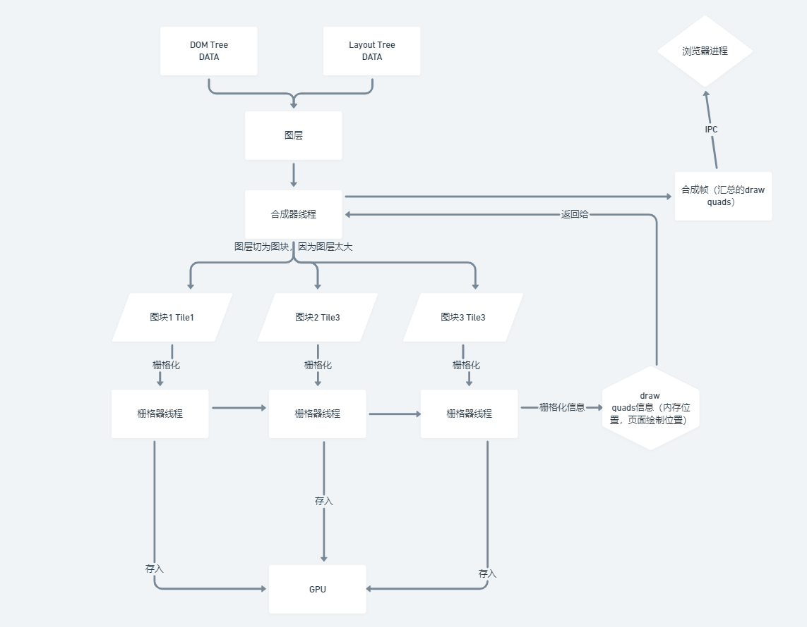

# 浏览器及工作方式

_[课程地址](https://www.bilibili.com/video/BV1x54y1B7RE)_

## 组成

浏览器 = 用户界面 + 浏览器引擎 + 渲染引擎

渲染引擎，又称为浏览器内核包括各种模块，如网络模块，JS 解析器。

浏览器引擎包含数据持久层。

## 渲染引擎

### 各浏览器渲染引擎

| 浏览器            | 渲染引擎 |
| ----------------- | -------- |
| IE                | Trident  |
| Firefox           | Gecko    |
| Safari            | Webkit   |
| Chrome/Opera/Edge | Blink    |

## 进程与线程

打开一个应用程序 => 启动一个进程 => 分配内存空间 => 进程关闭 => 内存回收

一个进程有多个线程执行任务，进程可以启动其他进程，并以 IPC 通信。



### 早期单进程浏览器

早期浏览器为单进程，一个线程卡死，整个进程卡死。

早期浏览器进程包括：页面线程，JS 线程等。

### 多进程浏览器



#### Chrome Process Model

-   Process-per-site-instance: 访问不同站点，或者同一站点不同页面会创建新的进程。
-   Process-per-site：同一站点使用一个进程。
-   Process-per-tab: 一个 tab 为一个进程。
-   Single-process: 浏览器和渲染引擎使用同一个进程。

## 地址栏输入会发生什么

-   浏览器进程下的 UI 进程会捕捉输入内容.
-   如果访问的是网站
    -   启动网络进程,请求 DNS 域名解析解析.
    -   连接服务器获取数据
-   如果不是网址
    -   使用默认搜索引擎搜索

## 获取数据后

-   浏览器检查是否为恶意站点 (SafeBrowsing _谷歌内部一套安全工具, 比如通过查看 IP 是否 blacklisted_)
    -   是: 展示警告页面
-   否: 网络进程通知 UI 进程
-   UI 进程创建一个渲染器进程渲染页面 (Renderer Process)
-   浏览器进程通过 IPC 管道将页面传给渲染器进程
-   渲染器进程解析 HTML
    -   Tokeniser
    -   Tree Construction
    -   创建 document 对象，向其添加各种元素
    -   如果遇到图片，css 等，直接下载，不影响构造
    -   如遇到 js，停止构造，先解析 js `document.write()` 重新 tokeniser
-   渲染器进程构造 DOM 结构
-   完成后获得 DOM Tree，然后解析计算样式
-   主线程通过遍历 DOM 和计算好的样式生成 Layout Tree(x, y 坐标，边框尺寸)

    -   DOM Tree Layout Tree 不是一一对应的，设置了 `display: none;` 的节点不会在 Layout Tree 上。
    -   `before` 伪类 `content` 不会出现在 DOM Tree 上而在 Layout Tree 上。

-   主线程遍历 Layout Tree 创建 Paint Record，记录绘制顺序。这个阶段为绘制 paint。主要是因为 `z-index` 等 Layout Tree 无法展现层级关系。
-   将所有信息转化为像素点，呈现在屏幕上，为栅格化 rastering。

    -   Chrome 早期只栅格化当前可视区域内容，向下滚动，再继续栅格化，但会有延迟。
    -   目前是合成 composting，将页面分为多个图层，分别栅格化，并在合成器线程中 compositor thread 合成页面。
    -   合成器线程把每个图层切成图块 tile（因为图层可能过大），然后发给栅格器线程栅格化，并存在 gpu 中。然后合成器收集 draw quads 信息（内存中位置，页面中哪个位置绘制）。
    -   合成器生成合成器帧 compostion frame。通过 IPC 传给浏览器进程，再传给 GPU，GPU 展示在屏幕上。
    -   滚动页面，生成新的合成器帧，再给浏览器进程，再给 GPU 放到屏幕上。

-   改变样式长宽等，会从新计算 layout 等以后所有任务，成为重排
-   改变样式颜色，重新细算 style，不会触发 layout 计算，但会触发以后的任务，成为重绘。

-   如果 js 占用时间过长，一帧内 js 没有执行完，会阻塞下一帧的渲染，页面卡顿。
    -   解决：`requestAnimationFrame()`一帧没有执行完，运行 js，下一帧开始，归还主线程先渲染，还有时间，再去执行 js。

### Tokeniser

啥是 tokensier, 举个例子

```javascript
import { Parser } from "html-tokenizer";

const html = '<p class="foo">Hello<br/></p>';

for (const token of Parser.parse(html)) {
	switch (token.type) {
		case "open": {
			console.log(`Opening tag: ${token.name}`);
			console.log("Attributes:", token.attributes);
		}
		case "text": {
			console.log(`Text node: ${token.text}`);
		}
		case "close": {
			console.log(`Closing tag: ${token.name}`);
		}
		case "comment": {
			console.log(`Comment: ${token.text}`);
		}
	}
}
```

```
Opening tag: p
Attributes: { class: 'foo' }
Text node: undefined
Closing tag: p
Comment: undefined
Text node: Hello
Closing tag: undefined
Comment: Hello
Opening tag: br
Attributes: {}
Text node: undefined
Closing tag: br
Comment: undefined
Closing tag: br
Comment: undefined
Closing tag: p
Comment: undefined
```

这个过程就是 tokeniser. 只有先将 HTML 解析成这个样子,才能构造 DOM 树.

### 我理解的栅格化流程


